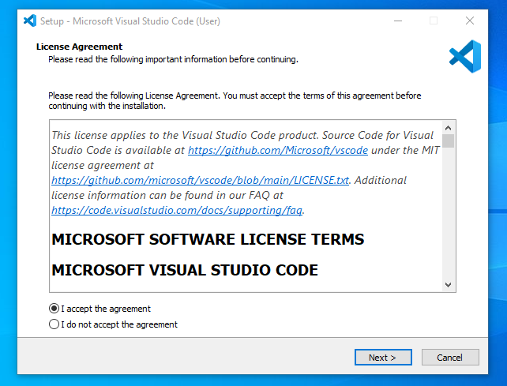
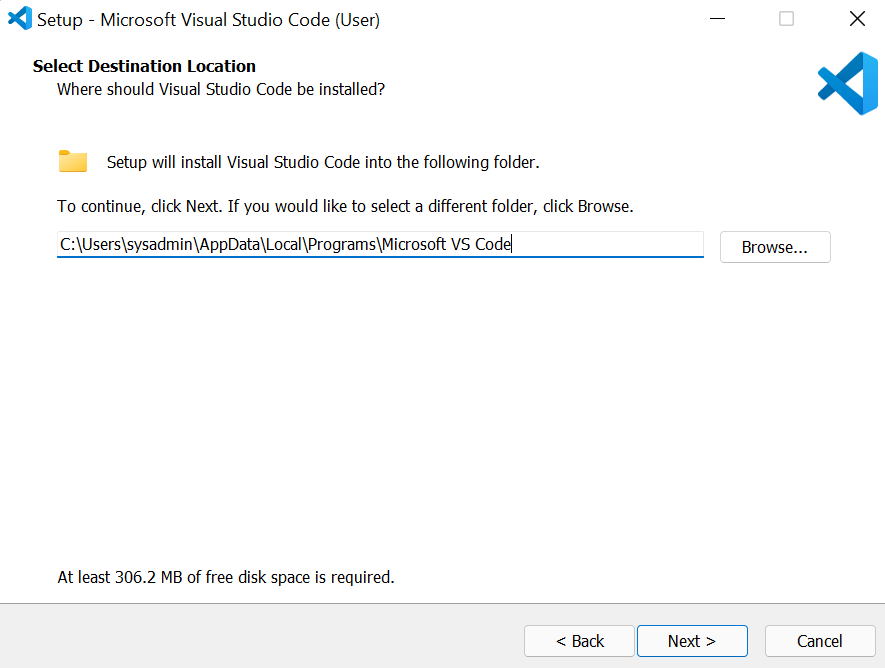
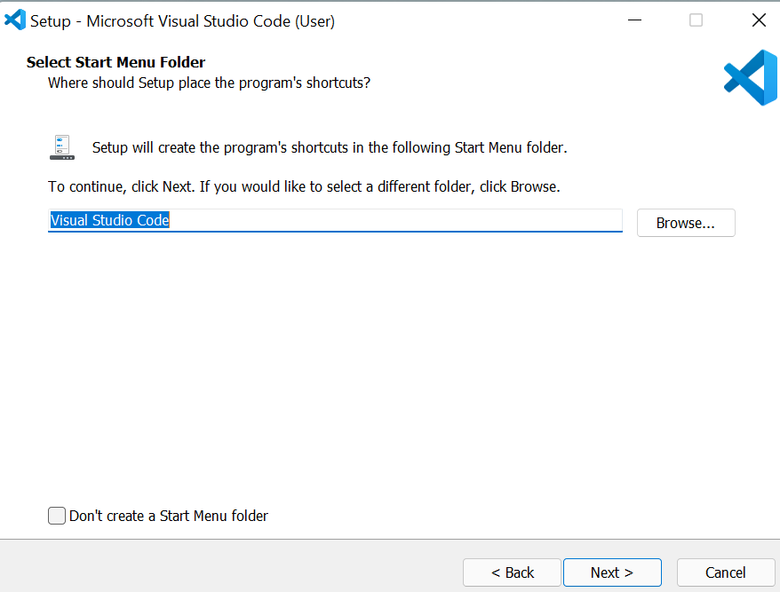
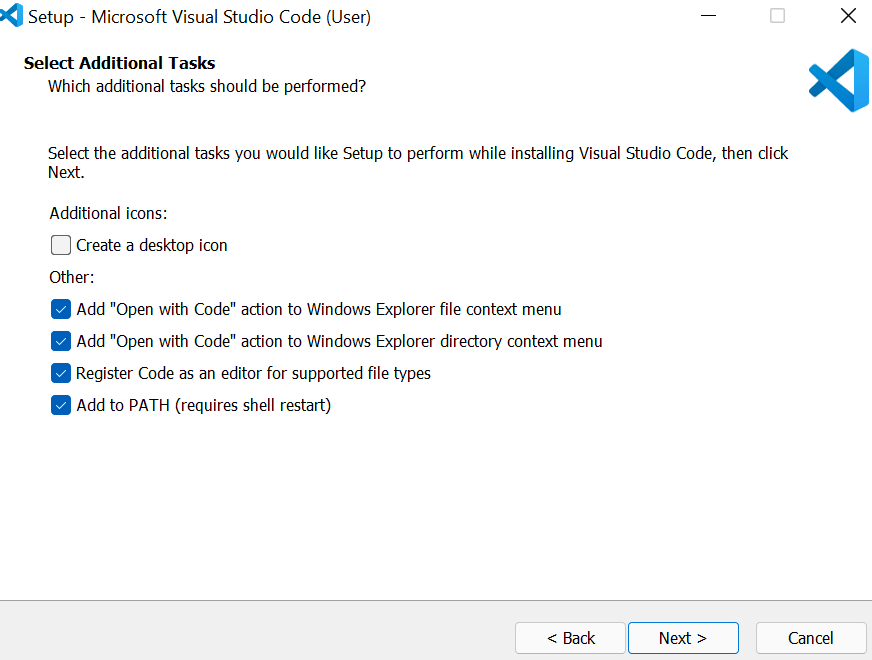
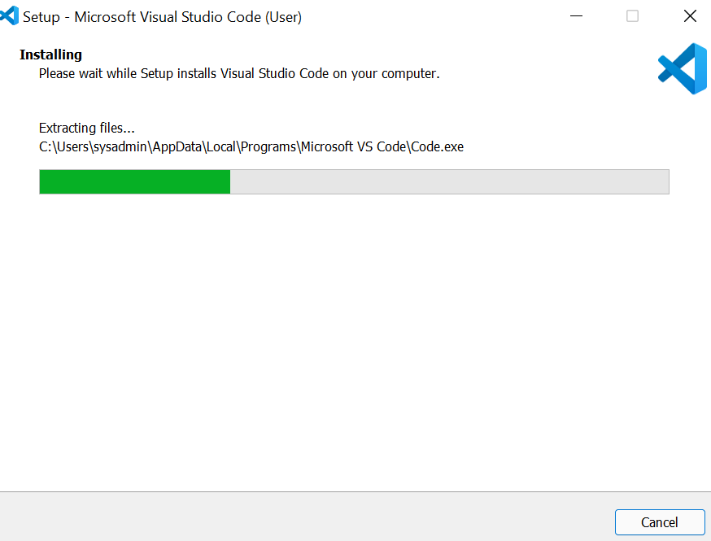
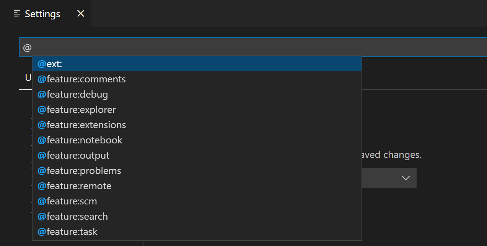

# SE-Assignment-5
Installation and Navigation of Visual Studio Code (VS Code)
 Instructions:
Answer the following questions based on your understanding of the installation and navigation of Visual Studio Code (VS Code). Provide detailed explanations and examples where appropriate.

 Questions:

1. ## ** Installation of VS Code:**
 Describe the steps to download and install Visual Studio Code on Windows 11 operating system. Include any prerequisites that might be needed.

When I first set out to download and install Visual Studio Code on Windows 11, I was struck by the simplicity of the process (bin, 2022). 

#### Process
    1. [Download the VS Code file from the offical website](https://code.visualstudio.com/)
    2.Download process will start
    3.Once the download is complete. Open the file and accept the agreement. 
    4. Select the drive location where you need to install the VS Code 
    5.Select the folder name for the vs Code setups files. 
    6.Select the additional task, you want to do by the installer. I wanted to have "Open with Code" added to both the File and Directory content menu, hence I selected those.
    7.Check if all the settings. Click on "< Back" if you need to change anything.
    8.Click on "Install", and the installation process will start.
    9.After installation, click "Finish"
   

**Prerequisites:**

   - Having Windows 11
   - Having administrator privileges made the installation straightforward, reminding me of the importance of these prerequisites for a smooth setup.

## ** First-time Setup:**
After installing VS Code, what initial configurations and settings should be adjusted for an optimal coding environment? Mention any important settings or extensions.

**Configuring VS Code for the First Time:**

Upon launching VS Code, I was immediately impressed by the clean, modern interface. My first task was to personalize the environment to suit my preferences.
 - Using the Command Palette (Ctrl+Shift+P) to change the color theme was intuitive, allowing me to select a theme that was easy on my eyes.
 - Adjusting the font size and family through the settings (Ctrl+,) was equally simple, highlighting VS Code's user-centric design.
 - Installing essential extensions like     
      1. Prettier
      2. ESLint
      3. GitLens 
      4.Live Server 

## **User Interface Overview:
   Explain the main components of the VS Code user interface. Identify and describe the purpose of the Activity Bar, Side Bar, Editor Group, and Status Bar.

   **Exploring the User Interface:**

Navigating through the VS Code user interface felt like uncovering the thoughtful design choices made by its creators.
 - **The Activity Bar**, with its quick access to Explorer, Search, Source Control, Run and Debug, and Extensions, was a testament to its well-organized layout. 
 - **The Side Bar**, provided detailed views, like file navigation in the Explorer, which was incredibly useful for project management.
 - **The Editor Group**, where the actual coding happens, was flexible and user-friendly, allowing multiple tabs and split views. 
 - **The Status Bar** at the bottom provided real-time information about the current file and project status, which was a subtle yet powerful feature that kept me informed without distraction.

## **Command Palette:**
 What is the Command Palette in VS Code, and how can it be accessed? Provide examples of common tasks that can be performed using the Command Palette.

   **Discovering the Command Palette:**

The Command Palette (Ctrl+Shift+P) quickly became an indispensable tool in my VS Code journey. It offered access to virtually every command in the editor, simplifying complex tasks. For example, 
 - changing the color theme or
 - installing extensions became as easy as typing a few characters.
 This feature underscored the efficiency and power of VS Code, making me more productive and confident in exploring new commands.

## **Extensions in VS Code:**
 Discuss the role of extensions in VS Code. How can users find, install, and manage extensions? Provide examples of essential extensions for web development.
    
   **The Role and Impact of Extensions:**

Extensions in VS Code are akin to adding superpowers to the editor.
To discovering/search the Extensions view (Ctrl+Shift+X) was eye-opening. Searching for and installing extensions like 
 - Prettier 
 - ESLint 
 - Live Server
 - Git lens
 - Python
 - flutter 
Debugger for Chrome transformed VS Code into a highly specialized tool tailored to my web development needs. Managing these extensions, including disabling or uninstalling them, was straightforward, ensuring I could keep my development environment lean and efficient.

## **Integrated Terminal:**
Describe how to open and use the integrated terminal in VS Code. What are the advantages of using the integrated terminal compared to an external terminal?

   **Embracing the Integrated Terminal:**

Opening the integrated terminal (Ctrl+ shift+`~` or View>Terminal`) within VS Code was a game-changer.
 1. It eliminated the need to switch between the editor and an external terminal, streamlining my workflow.
 2. This integration highlighted the thoughtful design behind VS Code, emphasizing convenience and efficiency. The ability to run commands directly within the editor reinforced the seamless nature of the development experience it offers.

## ** File and Folder Management:**
Explain how to create, open, and manage files and folders in VS Code. How can users navigate between different files and directories efficiently?

   **Managing Files and Folders Efficiently:**

Creating, opening, and managing files and folders in VS Code was intuitive. 
 1. Right-clicking in the Explorer view to create new files or folders.
 2. Using Ctrl+P to quickly open files, made navigation and organization effortless. 
 3. The breadcrumbs at the top of the editor were a pleasant surprise, allowing easy navigation between different files and directories. This functionality underscored VS Code's commitment to making file management as efficient as possible.

## Settings and Preferences:
Where can users find and customize settings in VS Code? Provide examples of how to change the theme, font size, and keybindings.

   **Customizing Settings:**

Finding and customizing settings in VS Code was a revelation in how user-friendly an editor can be. Accessing settings via **Ctrl+ shift + p** or the setting icon at bottom left within the sidebar, and changing themes, font sizes, and keybindings was straightforward. 
 - 
 - 
 - 

The ability to easily search for and modify settings demonstrated VS Code's flexibility and adaptability to individual preferences. It emphasized the importance of a personalized development environment in enhancing productivity and comfort.

## Debugging in VS Code:
Outline the steps to set up and start debugging a simple program in VS Code. What are some key debugging features available in VS Code?

   **Setting Up and Debugging:**

Setting up debugging in VS Code was a smooth process. Opening the Debug view (Ctrl+Shift+D) and configuring the launch.json file felt intuitive. Setting breakpoints by clicking in the gutter next to the line numbers and starting the debugging process with F5 highlighted the ease with which VS Code handles complex tasks. The debugging features, including breakpoints, step over, step into, and variable inspection, made the debugging process thorough and efficient.

## Using Source Control:
How can users integrate Git with VS Code for version control? Describe the process of initializing a repository, making commits, and pushing changes to GitHub.
     
   **Integrating Git with VS Code:**

Integrating Git with VS Code was a seamless experience. Initializing a repository from the Source Control view (Ctrl+Shift+G) and making commits demonstrated VS Code's robust version control capabilities . The process of adding a remote repository and pushing changes to GitHub reinforced the importance of version control in development. Using the Source Control view to manage changes, stage files, and commit updates emphasized VS Code's integration with Git, making version control an integral part of the development workflow.

## Refences
https://www.geeksforgeeks.org/how-to-install-visual-studio-code-on-windows
https://www.c-sharpcorner.com/article/how-to-install-visual-studio-code-on-windows-11/
bin Uzayr, S. (2022). Mastering Visual Studio Code: A Beginner's Guide. CRC Press.
 Submission Guidelines:

- Provide screenshots or step-by-step instructions where applicable.
- Cite any references or sources you use in your answers.
- Submit your completed assignment by 1st July 

